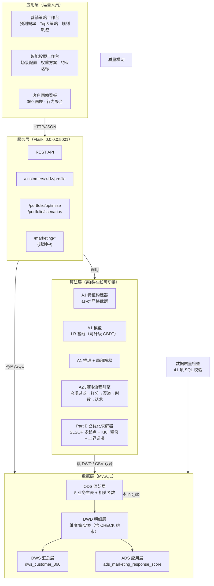
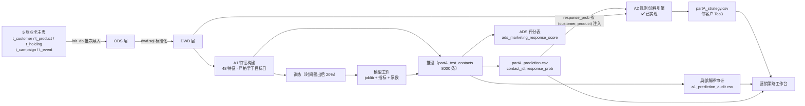
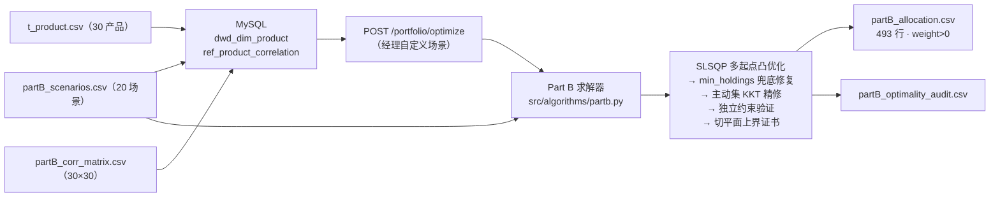
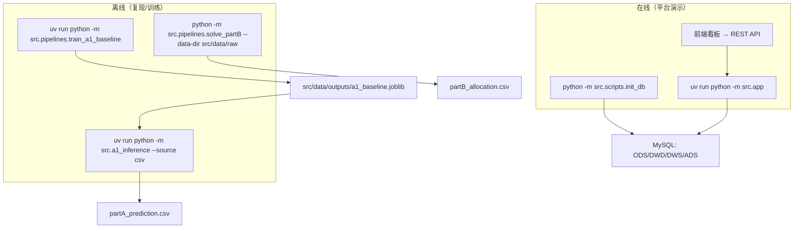

# 智能财富管理运营平台 · 系统架构设计

> 版本：v1.0（2026-03 分析基准日口径）
> 状态图例：✅ 已实现并验证 ｜ 🟡 设计已定、待实现 ｜ ⬜ 待设计

---

## 1. 架构目标

以「两条核心数据链路 + 一个运营平台」为主线：

1. **营销链路（Part A）**：营销响应预测（A1）→ 营销策略生成（A2），支撑精细化营销触达；
2. **投顾链路（Part B）**：组合配置优化，支撑智能投顾；
3. **平台底座（Part C/D）**：数据分层架构、规则/流程引擎、HTTP 服务、运营可视化看板。

设计原则：

- **可复现**：`random_state=42` 固定随机过程；训练/推理共用同一特征构建器；模型/特征版本双重校验；
- **可解释**：预测有局部解释、策略有规则轨迹、优化有全局最优性证书；
- **防泄漏**：所有特征严格 as-of 截断，时间留出验证；
- **可运营**：规则可配置、可开关、可追溯，运营人员在看板上可干预。

---

## 2. 题目模块与系统组件映射

| 题目模块 | 分值性质 | 系统组件 | 状态 |
|----------|----------|----------|------|
| A1 营销响应预测 | 30 分自动 | `src/a1_features.py`、`src/pipelines/train_a1_baseline.py`、`src/a1_inference.py` | ✅ |
| A2 营销策略生成 | 5 分自动 + D 验收 | 规则/流程引擎（`src/marketing/`）+ 策略契约 + CSV 生成 | ✅（CSV 导入落库 🟡） |
| B 投资组合优化 | 15 分自动 | `src/algorithms/partb.py`（核心）、`src/pipelines/solve_partB.py`（CLI）、`src/portfolio.py` | ✅ |
| C 系统架构与工程 | 人工 | 数据分层（ODS→DWD→DWS→ADS）、Flask 服务、质量检查、测试、规则/流程引擎 | ✅ |
| D 平台演示与看板 | 人工 | 前端三工作台（营销策略 / 智能投顾 / 客户画像） | ⬜ |
| 加分创新 | 人工 | 全局最优性证书、局部解释审计、规则轨迹、特征/模型版本管理 | ✅ 部分 |

---

## 3. 总体架构

- **算法层与数据层解耦**：算法既可从 MySQL DWD 读数据（平台模式），也可从 CSV 读数据（离线复现模式），训练与推理共用同一特征构建器，保证两种模式下特征口径一致。
- **服务层无状态**：产品/相关系数等只读数据做进程级缓存（`lru_cache`），场景配置持久化在 MySQL。

---

## 4. 数据链路一：营销响应与策略（Part A）

链路要点：

- **时间穿越防护**（三道防线）：① 持仓特征仅用 `buy_date < contact_date`；② 行为事件仅用 `event_date < contact_date`；③ 历史触达仅用 `contact_date < 当前 contact_date`；④ 训练验证按日期后 20% 留出（cutoff 2026-01-14），不用随机切分。
- **A1 当前验证指标**：AUC 0.8619（锚点 0.85=17 分）、F1 0.595（锚点 0.615=7 分，约 6.3）、Lift@10% 3.738（锚点 3.3=6 分）。
- **A1→A2 联动**：A1 输出 `response_prob` 按 `(customer_id, product_id)` 键注入 A2 引擎打分，作为排序因子之一（详见 `sdd-marketing.md`）。

---

## 5. 数据链路二：智能投顾组合优化（Part B）

链路要点：

- 效用函数最大化等价转化为**凸函数最小化**，约束全部线性化（流动性约束等价为"封闭产品权重 ≤ 1−min_liquid_weight"）；
- **全局最优性证书**：利用凸函数一阶切平面 + 线性规划构造效用全局上界，当前 20 个场景 optimality gap ≈ 1e-18（机器精度）；
- 提交文件落盘后**重新读回独立校验**，防止四舍五入破坏可行性；
- 当前验证：20 场景全部约束通过，落盘 total_U ≈ 0.6112。

---

## 6. 模块清单与职责边界

| 模块 | 职责 | 状态 |
|------|------|------|
| `src/a1_features.py` | 训练/推理共用特征构建（48 特征，as-of 截断） | ✅ |
| `src/pipelines/train_a1_baseline.py` | LR 基线训练、时间留出验证、模型工件产出 | ✅ |
| `src/a1_inference.py` | 批量推理、解释审计、提交文件与 ADS 落表、格式自校验 | ✅ |
| `src/algorithms/partb.py` | Part B 凸优化求解核心 + 证书 + 独立验证（被服务层复用） | ✅ |
| `src/pipelines/solve_partB.py` | Part B CLI 入口（编排，`python -m` 执行） | ✅ |
| `src/portfolio.py` | 组合优化 API 适配（读 MySQL，参数校验） | ✅ |
| `src/scenario.py` | 场景配置 CRUD | ✅ |
| `src/customer.py` | 客户画像查询（DWS） | ✅ |
| `src/scripts/init_db.py` | 建库建表、批次导入、重建 DWD/DWS | ✅ |
| `src/sql/schema.sql` | 13 张表结构 + CHECK 约束 | ✅ |
| `src/sql/dwd.sql` / `src/sql/warehouse.sql` | DWD 标准化、DWS 画像 | ✅ |
| `src/sql/quality_checks.sql` | 41 项数据质量检查 | ✅ |
| `src/tests/` | 55 个单元测试 | ✅ |
| `src/marketing/` | A2 规则/流程引擎：13 条规则、两阶段流水线、协同过滤、话术、校验 | ✅ |
| `src/scripts/import_strategy.py`（规划） | 导入队友 `partA_strategy.csv` 落库 | 🟡 |
| `frontend/`（规划） | 三工作台看板 | ⬜ |

---

## 7. 技术选型

| 层 | 选型 | 理由 |
|----|------|------|
| 语言 | Python 3.12 | 团队熟悉、算法生态完整 |
| Web 服务 | Flask 3.x | 轻量、演示可控、无重框架包袱 |
| 数据库 | MySQL 8（utf8mb4） | 分层建模（ODS/DWD/DWS/ADS）、约束与索引完整 |
| 特征/数值 | pandas + numpy | 特征工程与矩阵运算 |
| 机器学习 | scikit-learn（LR 基线，可扩展 GBDT） | 可解释性优先；版本化工件（joblib） |
| 优化 | scipy（SLSQP / linprog / root） | 凸问题精确求解 + 证书 |
| 前端（规划） | 待定（建议轻量 SPA，讨论见 `sdd-platform.md` §5） | 明天与队友对齐 |
| 依赖管理 | uv + pyproject（提交时补 requirements.txt） | 可复现环境 |

---

## 8. 关键架构决策（ADR 摘录）

| # | 决策 | 理由 | 备选（未采用） |
|---|------|------|----------------|
| 1 | 训练/推理共用 `a1_features.py`，特征带版本号 | 口径唯一、防训练推理错配 | 两份独立特征代码（易漂移） |
| 2 | 时间留出验证（后 20% 日期） | 贴合真实预测场景，防时间泄漏 | 随机 K 折（会高估） |
| 3 | as-of 一律取**严格早于**目标日 | 题目时间穿越约束的保守实现 | 含当日（有泄漏风险） |
| 4 | 历史响应率用 Beta(2,8) 平滑 | 无历史时的中性先验 20%，避免 0/0 | 加一平滑（偏乐观） |
| 5 | Part B 用凸化 + SLSQP 多起点，而非黑盒进化算法 | 凸问题可证全局最优，配切平面上界证书 | 遗传算法（无最优性保证） |
| 6 | 算法层支持 MySQL/CSV 双数据源 | 平台模式与离线复现共用一套代码 | 只读 MySQL（答辩现场不便） |
| 7 | 业务规则进规则引擎（声明式 + 轨迹），不散落在脚本 | 可配置、可开关、可解释，支撑 D 联动 | 硬编码 if/else |
| 8 | 模型/特征/提交文件三重自校验 | 任何格式违例 A1/A2 直接 0 分，必须前置拦截 | 人工检查 |

---

## 9. 运行视图

演示现场推荐顺序：`init_db.py` → 起服务 → 看板演示三条链路 → 必要时离线复跑训练/求解证明可复现。

---

## 10. 架构与评分标准映射

| 评分项 | 架构支撑 | 状态 |
|--------|----------|------|
| A1 AUC/F1/Lift | 特征工程 + 时间验证 + 模型工件 | ✅ 已达标 |
| A2 HitRate@3 | 产品排序（A1 + 协同过滤信号，队友可替换） | ✅ |
| A2 格式合规 | 提交校验器（`src/marketing/validate.py`） | ✅ |
| B 效用分数 | 凸优化 + 证书 | ✅ |
| C 架构与工程 | 分层数据架构、质量检查、测试、双源算法层 | ✅ |
| C 规则/流程引擎 | `src/marketing/`（两阶段流水线 + 13 规则 + 配额） | ✅ |
| D 运营看板与联动 | 三工作台 + 规则轨迹/开关 | ⬜ |
| 加分 | 最优性证书、解释审计、版本管理、规则轨迹 | ✅ 部分 |

> 差距与分工详见 `roadmap.md`。
