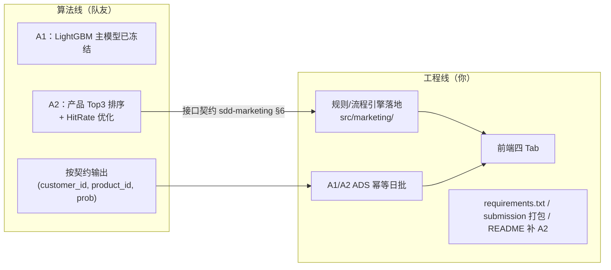

# 差距清单与分工路线图

> 用途：历史分工记录；当前项目已进入功能冻结与答辩准备阶段
> 关联：本文档是 `architecture.md` §10 的展开

---

## 1. 与评分标准的差距总览

| 模块 | 分值性质 | 当前状态 | 缺口 | 建议负责人 |
|------|----------|----------|------|-----------|
| A1 响应预测 | 30 自动 | ✅ LGBM 提交文件合法，验证 AUC 0.8828 / F1 0.6185 / Lift 4.0047（三项满分锚点） | 冻结结果 | 队友 |
| A2 策略生成 | 5 自动 + D 验收 | ✅ A1概率排序、规则过滤、ADS日批与提交CSV均已打通 | 冻结结果 | 队友 + 工程线 |
| B 组合优化 | 15 自动 | ✅ 提交合法，gap≈1e-18（投影 15/15） | 无 | 已交付 |
| C 架构与工程 | 人工 | ✅ 数据分层/41项质量检查/API/121测试/规则引擎 | 冷启动复验 | 工程线 |
| D 演示与看板 | 人工 | ✅ 今日工作台 + 四个核心业务页面已联通 | 截图、录屏、演练 | 前端成员 + 工程线 |
| 加分 | 人工 | ✅ gap 证书/解释审计/版本管理 | 规则轨迹可视化（随引擎） | 工程线 |
| 提交物打包 | — | ✅ 根目录已包含三 CSV、源码、前端、README 与 requirements | 压缩后命名为 submission | 工程线 |

**自动分核心结果已通过本地红线校验**；当前工作重点是人工评分材料、演示稳定性与答辩表达，不再扩展功能范围。

---

## 2. 分工建议（明天对齐用）

**接口契约要点（队友侧只需知道）**：

- 业务日批输入：MySQL DWD 客户、产品、持仓、触达和行为数据；
- A1 概率排序后由 A2 基础规则过滤，最终 Top3 与规则轨迹幂等写入 ADS；
- 枚举与列名以 `docs/sdd-marketing.md` §6 为准，提交前双方各跑一遍校验器。

---

## 3. 里程碑

| 里程碑 | 内容 | 产出 | 建议时限 |
|--------|------|------|----------|
| M1 契约对齐 | 明天会议确认：分工、CSV 合并方式、前端交互方向（方案 A/B） | 会议纪要 + 契约定稿 | 明天 |
| M2 引擎落地 | `src/marketing/` 规则、批处理与查询模块 | 规则引擎与 ADS 日批可重复运行、全仓 121 测试全绿 | ✅ 已完成 |
| M3 A2 打通 | A1概率排序 + 规则过滤 + 格式校验 | ADS Top3 + `partA_strategy.csv`（6000 行） | ✅ 已完成 |
| M4 前端看板 | 今日工作台 + 四个核心页面联动 | `frontend/` | ✅ 已完成 |
| M5 打包提交 | 根目录全量复跑并压缩命名为 submission | 完整提交压缩包 | 提交前 |

**关键路径**：M2 引擎 → M3 A2 打通 → M4 前端（Tab3 依赖引擎轨迹与营销 API）。队友的产品 Top3 与 M2 可并行。

---

## 4. 风险清单

| 风险 | 影响 | 对策 |
|------|------|------|
| A2 格式违例 → 0 分 | 5 分归零 + D 验收无素材 | 校验器前置 + 双重校验（队友跑一遍、平台跑一遍） |
| A1 正式文件被误覆盖 | 自动分风险 | 固定三份 CSV 哈希；除非新结果完整通过校验，否则不再生成 |
| 队友 CSV 与引擎枚举不一致 | 合并错误/格式翻车 | 契约文档 + 共用常量源（models.py 落地后） |
| 前端工作量超预期 | M4 延期挤压提交 | 先方案 A 静态版保证"有演示"，再升级联动 |
| 答辩现场复现失败 | 人工分打折 | 演示前全量复跑：init_db → 训练 → 推理 → 求解 → 起服务 |
| requirements.txt 与 uv.lock 不一致 | 环境纠纷 | 导出后实际装一遍验证 |

---

## 5. 待办速查（按优先级）

1. 🔴 全链路冷启动演练并记录命令
2. 🔴 PPT 数字统一引用 `presentation.md`
3. 🔴 四个核心页面截图与 30 秒兜底录屏
4. 🟡 团队分工、创新点和追问口径演练
5. 🟡 最终压缩包内排除 `.env`、`.venv`、`node_modules`
