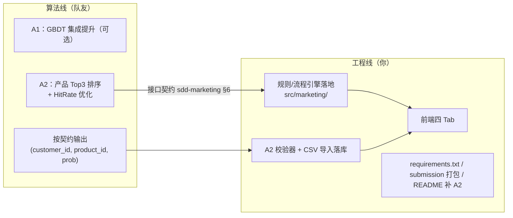

# 差距清单与分工路线图

> 用途：明天团队沟通分工与排期
> 关联：本文档是 `architecture.md` §10 的展开

---

## 1. 与评分标准的差距总览

| 模块 | 分值性质 | 当前状态 | 缺口 | 建议负责人 |
|------|----------|----------|------|-----------|
| A1 响应预测 | 30 自动 | ✅ 提交文件合法，验证 AUC 0.8619 / F1 0.595 / Lift 3.738（投影 ≈29.3/30） | 可选：GBDT 集成抬 F1 余量 | 队友 |
| A2 策略生成 | 5 自动 + D 验收 | ✅ 规则引擎已落地，`partA_strategy.csv` 6000 行生成并通过校验 | ①队友产品排序优化 ②CSV 导入落库 | 产品部分队友；引擎部分工程线 |
| B 组合优化 | 15 自动 | ✅ 提交合法，gap≈1e-18（投影 15/15） | 无 | 已交付 |
| C 架构与工程 | 人工 | ✅ 数据分层/质量检查/API/测试/规则引擎 | ①CSV 导入落库 ②requirements.txt | 工程线 |
| D 演示与看板 | 人工 | ⬜ 无前端 | 官方四 Tab（规格已定稿 sdd-platform §4）+ 演示脚本 | 前端成员 + 工程线 |
| 加分 | 人工 | ✅ gap 证书/解释审计/版本管理 | 规则轨迹可视化（随引擎） | 工程线 |
| 提交物打包 | — | 🟡 缺 requirements.txt、A2 CSV、frontend；submission 需按清单归位 | 打包收尾 | 工程线 |

**自动分投影 ≈ 44.3/50**（A1 29.3 + B 15；A2 待队友），人工 50 分目前只有底子（C 主体），D 和规则引擎是最大增量。

---

## 2. 分工建议（明天对齐用）

**接口契约要点（队友侧只需知道）**：

- 引擎输入：`(customer_id, product_id, response_prob)` 三元组（或直接读 `partA_prediction.csv` 映射回 customer×product）；
- CSV 最终合并：`rank+product_id` 来自队友，`channel/time/script` 来自引擎；
- 枚举与列名以 `docs/sdd-marketing.md` §6 为准，提交前双方各跑一遍校验器。

---

## 3. 里程碑

| 里程碑 | 内容 | 产出 | 建议时限 |
|--------|------|------|----------|
| M1 契约对齐 | 明天会议确认：分工、CSV 合并方式、前端交互方向（方案 A/B） | 会议纪要 + 契约定稿 | 明天 |
| M2 引擎落地 | `src/marketing/` 十模块 + 4 个测试文件 | 规则引擎可跑、55 测试全绿 | ✅ 已完成 |
| M3 A2 打通 | 引擎生成 partA_strategy.csv + 格式校验通过 | `partA_strategy.csv`（6000 行） | ✅ 已完成（队友产品排序可后续替换） |
| M4 前端看板 | 官方四 Tab：M1 静态填充 → M2 联动（营销/进件 API） | `frontend/` + 截图 | 2~3 天 |
| M5 打包提交 | requirements.txt、submission 归位（三 CSV + src/ + frontend + README + requirements）、全量复跑 | 完整 submission 目录 | 提交前 1 天 |

**关键路径**：M2 引擎 → M3 A2 打通 → M4 前端（Tab3 依赖引擎轨迹与营销 API）。队友的产品 Top3 与 M2 可并行。

---

## 4. 风险清单

| 风险 | 影响 | 对策 |
|------|------|------|
| A2 格式违例 → 0 分 | 5 分归零 + D 验收无素材 | 校验器前置 + 双重校验（队友跑一遍、平台跑一遍） |
| A1 F1 在锚点附近波动 | ±1 分 | 有余力加 GBDT 集成；阈值策略保持与后台扫描口径一致 |
| 队友 CSV 与引擎枚举不一致 | 合并错误/格式翻车 | 契约文档 + 共用常量源（models.py 落地后） |
| 前端工作量超预期 | M4 延期挤压提交 | 先方案 A 静态版保证"有演示"，再升级联动 |
| 答辩现场复现失败 | 人工分打折 | 演示前全量复跑：init_db → 训练 → 推理 → 求解 → 起服务 |
| requirements.txt 与 uv.lock 不一致 | 环境纠纷 | 导出后实际装一遍验证 |

---

## 5. 待办速查（按优先级）

1. 🔴 规则/流程引擎落地（`sdd-marketing.md` §7 规格已定稿）
2. 🔴 A2 契约与队友对齐（明天会议第一议题）
3. 🔴 `partA_strategy.csv` 产出并过校验器
4. 🟠 前端四 Tab（规格已定稿，明天讨论分工与排期）
5. 🟡 requirements.txt + submission 打包 + README 补 A2
6. 🟢 可选：A1 GBDT 集成、答辩 PPT 实拍素材
