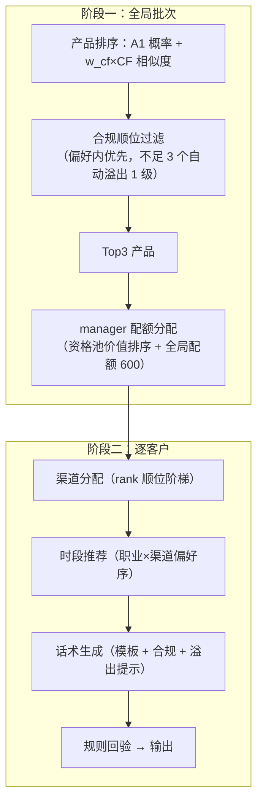

# SDD · 营销链路（Part A）规格

> 范围：A1 营销响应预测（30 分自动）+ A2 营销策略生成（5 分自动 + Part D 验收）
> 状态：A1 ✅ ｜ A2 规则/流程引擎 ✅ 已实现（本文件为定稿 v2）
> 关联：[architecture.md](architecture.md) §4

---

## 1. A1 目标与判分口径

对 `partA_test_contacts.csv`（8000 条，列 `contact_id, customer_id, product_id, channel, contact_date`）逐条预测 `response_prob`，提交 `partA_prediction.csv`（列 `contact_id, response_prob`）。

| 指标 | 满分 | 地板 | 低锚点→分 | 高锚点→分 | 当前验证值 |
|------|------|------|-----------|-----------|------|
| AUC | 17 | 3.4 | 0.79→6.8 | 0.85→17 | **0.8619** ✅ |
| F1（3 位小数阈值扫描） | 7 | 1.4 | 0.50→2.8 | 0.615→7 | **0.595**（约 6.3 分） |
| Lift@10% | 6 | 1.2 | 2.6→2.4 | 3.3→6 | **3.738** ✅ |

格式红线（违者 A1 记 0 分）：精确覆盖全部 contact_id、不重复不多交、概率 ∈ [0,1]、≤5 MiB。当前提交文件已通过全部自校验。

## 2. A1 特征规格（`src/a1_features.py`，v1）

**48 个特征 = 16 类别 + 32 数值**，训练/推理共用，`FEATURE_VERSION = "a1_features_v1"`。

- 类别：客户画像 6 + 产品属性 4 + 触达属性 3 + 交互特征 3（`product_channel` / `risk_pair` / `vip_channel`）
- 数值：基础 6、时点 2、匹配度 4、持仓 5、行为 7、历史营销 8（含 Beta(2,8) 平滑响应率）
- **as-of 三道防线**：持仓 `buy_date < contact_date`；事件 `event_date < contact_date` 且按 30/90 天窗口；历史触达 `< 当前 contact_date`；验证按日期后 20% 留出（cutoff 2026-01-14）

## 3. A1 训练规格（`src/pipelines/train_a1_baseline.py`）

LogisticRegression（class_weight=balanced, lbfgs, max_iter=2000, random_state=42），时间留出验证（训练 40095 / 验证 9905），评估口径与后台一致（3 位小数阈值扫描 F1、前 10% Lift）。产物：`src/data/outputs/a1_baseline.joblib`（含版本元数据）+ 指标 JSON + 全局系数 CSV。

## 4. A1 推理规格（`src/a1_inference.py`）

MySQL DWD / CSV 双数据源共用特征构建器；模型/特征版本双重校验；输出 `partA_prediction.csv`（12 位小数）并回读自校验；局部解释审计（top±5 因子 + 证据字段）落 `a1_prediction_audit.csv`；可选持久化 `ads_marketing_response_score`（含 explanation_json）。

---

## 5. A2 目标与判分口径

- 输入：`partA_strategy_customers.csv`（2000 客户，列 `customer_id, strategy_date`；**实际 strategy_date 全为 2026-04-15**，as-of 截断以此为准，非基准日 03-31）
- 输出：`partA_strategy.csv`，每客户恰好 3 行（rank=1/2/3，3 个产品不重复）
- **HitRate@3 = 命中客户数 ÷ 2000**，锚点 0.30→2 分、0.55→5 分
- 渠道/时段/话术不改变 HitRate 自动分，其个性化、合规性、平台联动由 Part D 现场验收

## 6. A2 设计哲学（v2 定稿）

**模型管产品，规则管其余。**
产品排序 = A1 模型概率 + 协同过滤相似度（纯信号，权重可调）；
规则只做合规拦截、渠道/时段/话术决策、manager 配额与格式校验。
队友若替换产品排序逻辑，只需换排序信号注入，引擎其余部分不受影响。

## 7. 两阶段流水线（`src/marketing/pipeline.py`，✅ 已实现）



- 全流程确定性执行（tie-break：product_id / customer_id 字典序），无随机数
- 每客户产出 `StrategyResult`：items（策略行）+ steps（6 步轨迹）→ `to_dict()` 供看板直用

## 8. 产品排序信号（§ 模型管产品）

```
score = A1 response_prob + w_cf × cf_score        # 默认 w_cf = 0.3
```

### 8.1 持有产品协同过滤（`src/marketing/collaborative.py`）

- item-based 共持相似：`sim(i→j) = 同时持有 i、j 的客户数 / 持有 i 的客户数`（非对称）
- `cf_score(c, j) = max{ sim(i→j) : i ∈ 客户持仓 }`，排除已持有产品，无持仓客户为 0（冷启动）
- as-of：只统计 `buy_date < strategy_date` 的持仓
- **数据证据**：推荐产品与持仓相似度中档（0.05~0.2）的触达响应率 24.3% vs 无信号 16.5%（+47%）；精确持有响应率 0.364 vs 0.180（2 倍，该信号归队友排序特征）

## 9. 规则目录（`src/marketing/rules.py`，13 条，✅ 已实现）

| 类别 | rule_id | 硬/软 | 判定 |
|------|---------|-------|------|
| 合规 | `risk_match` | 硬 | 产品风险 ≤ 客户偏好；候选 <3 时自动溢出 1 级（`max_allowed_risk`） |
| 合规 | `product_launched` | 硬 | launch_date ≤ strategy_date |
| 合规 | `customer_registered` | 硬 | register_date ≤ strategy_date |
| 记录 | `duration_valid` | 记录 | **仅留痕不拦截**：评分不校验存续期，产品池以发放 30 个为准 |
| 记录 | `min_invest_affordable` | 记录 | 仅展示用，不参与 A2 评分 |
| 渠道 | `channel_app_requires_app` | 硬 | app_push 要求 has_app=1 |
| 渠道 | `channel_call_complaint_block` | 硬 | 近 90 天投诉 ≥2 禁 call（风险规则） |
| 渠道 | `channel_manager_quota` | 硬 | manager 须命中全局配额 |
| 渠道 | `channel_manager_eligible` | 软 | 记录资格依据（金卡/钻石 或 AUM≥50万） |
| 时段 | `slot_in_enum` | 硬 | 5 个规定时段枚举 |
| 话术 | `script_length` | 硬 | 10 ≤ 字符数 ≤ 300 |
| 话术 | `script_compliance_note` | 硬 | 含「理财非存款，产品有风险，投资须谨慎」 |
| 话术 | `script_overshoot_warning` | 硬 | 溢出产品话术含「风险等级高于您的风险偏好，请谨慎选择」 |

### 9.1 manager 渠道配额（方案 B：资格 + 全局配额）

- 资格池：金卡/钻石 或 AUM≥50万（实测 595 人 / 29.8%）
- 配额：600 行（10%），参数 `--manager-quota` 可调
- 分配序：钻石→金卡→高AUM（层内按 AUM 降序、customer_id 兜底），第一轮每人至多 1 条（rank1），余量第二轮给钻石/金卡第 2 条（rank2）
- 依据：历史 manager 渠道占比 24.6%（全量客户口径），目标名单收紧至 10% 聚焦高价值客户

### 9.2 渠道阶梯与时段偏好

- 渠道阶梯：app_push(有App) → call(无投诉) → sms；manager 配额命中行插入 rank 顺位（rank1→最优渠道，rank2→次优……自然形成渠道多样性）
- 时段：职业主序 × 渠道修正拼接偏好序，55+ 前置工作日 09:00-12:00；rank1/2/3 取偏好序前 3 位
- 说明：周末/工作日响应率持平（0.188 vs 0.184），时段规则定位为业务惯例（职业作息 + 外呼合规时段），答辩不宣称数据挖掘结论

## 10. 话术模板（`src/marketing/templates.py`，✅ 已实现）

四渠道语态（sms 精炼 / app_push 推送 / call 顾问 / manager 贵宾专享），要素：产品名、风险等级、类型、业绩比较基准、期限（duration=0 显示"灵活存续"）、起投额、流动性；溢出产品追加风险提示；合规提示语永久保留，长度强制 ≤300（超长截断销售主体部分）。

## 11. 提交校验器（`src/marketing/validate.py`，✅ 已实现）

与题目红线逐条对应：列名/顺序、customer_id 非空、rank∈{1,2,3} 且每人恰好 3 行、产品不重复、渠道/时段枚举、话术 10–300 字符、文件 ≤10 MiB、客户精确覆盖。队友提交前可独立调用 `validate_strategy_file()`。

## 12. 复现步骤

```bash
# A1 训练
uv run python -m src.pipelines.train_a1_baseline
# A1 推理（CSV 源，离线复现）
uv run python -m src.a1_inference --source csv
# A2 策略生成（规则/流程引擎）
uv run python -m src.marketing
```

A2 产出：`partA_strategy.csv`（6000 行）+ `src/data/outputs/a2_strategy_audit.csv`（逐行分数/信号/溢出/渠道）+ `a2_cf_similarity.csv`（共持相似矩阵）。

## 13. 当前验证结果（2026-04-15 as-of 口径）

| 检查项 | 结果 |
|--------|------|
| 行数 / 客户覆盖 | 6000 / 2000 ✅ |
| 每人 3 行、rank 1/2/3、产品不重复 | ✅ |
| 渠道/时段枚举、话术长度与合规提示 | ✅ |
| manager 配额 | 600 行，全部命中资格客户 ✅ |
| 无 App 客户出 app_push | 0 ✅ |
| 投诉 ≥2 客户出 call | 0 ✅ |
| 溢出行 | 399（恰好 = R1 客户数，每人 1 条溢出）✅ |
| 格式校验器 | 0 错误 ✅ |

## 14. A 链路测试

`tests/test_marketing_rules.py`（13 条规则正反/边界）、`test_marketing_collaborative.py`（方向性相似度/as-of/自持有排除）、`test_marketing_pipeline.py`（溢出补齐、配额分配、渠道禁用、信号排序、确定性、轨迹）、`test_marketing_validate.py`（每条红线反例）；全仓 55 测试全绿。
