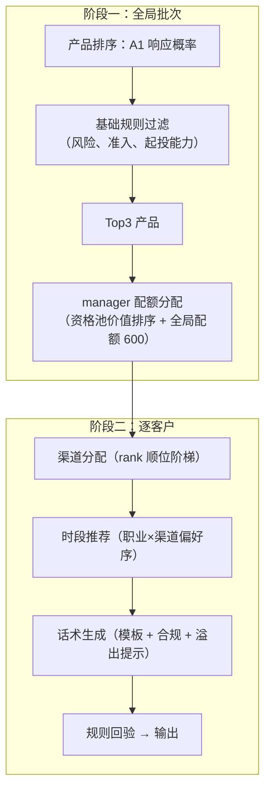

# SDD · 营销链路（Part A）规格

> 范围：A1 营销响应预测（30 分自动）+ A2 营销策略生成（5 分自动 + Part D 验收）
> 状态：A1 ✅ ｜ A2 规则/流程引擎 ✅ 已实现（本文件为定稿 v2）
> 关联：[architecture.md](architecture.md) §4

---

## 1. A1 目标与判分口径

对 `partA_test_contacts.csv`（8000 条，列 `contact_id, customer_id, product_id, channel, contact_date`）逐条预测 `response_prob`，提交 `partA_prediction.csv`（列 `contact_id, response_prob`）。

| 指标 | 满分 | 地板 | 低锚点→分 | 高锚点→分 | 当前验证值 |
|------|------|------|-----------|-----------|------|
| AUC | 17 | 3.4 | 0.79→6.8 | 0.85→17 | **0.8828** ✅ |
| F1（3 位小数阈值扫描） | 7 | 1.4 | 0.50→2.8 | 0.615→7 | **0.6185** ✅ |
| Lift@10% | 6 | 1.2 | 2.6→2.4 | 3.3→6 | **4.0047** ✅ |

格式红线（违者 A1 记 0 分）：精确覆盖全部 contact_id、不重复不多交、概率 ∈ [0,1]、≤5 MiB。当前提交文件已通过全部自校验。

## 2. A1 特征规格（`src/partA1serving/`，schema v3）

**46 个特征 = 13 类别 + 33 数值**，训练/推理共用；模型工件的
`schema_version = 3`，并记录特征列顺序与 as-of 截止日期。

- 类别：触达渠道、产品 ID/类型/风险/流动性、6 项客户画像、2 项交叉特征，共 13 项。
- 数值：客户与产品基础数值、风险/起投/收益匹配、持仓与行为统计、历史营销平滑响应率，共 33 项。
- **as-of 三道防线**：持仓 `buy_date < contact_date`；事件 `event_date < contact_date` 且按窗口聚合；历史触达 `< 当前 contact_date`；验证按日期留出（cutoff 2026-02-01）。

## 3. A1 训练规格（`src/partA1serving/training/`）

主模型为 one-hot LightGBM，固定 `random_state=42`；demo 工件按 2026-02-01
切分训练 42642 行、验证 7358 行，full 工件使用 50000 行历史触达训练。
评估口径为 3 位小数阈值扫描 F1 与前 10% Lift。LR 工件作为可解释基线保留，
两类工件都携带模型名、特征顺序、训练范围与 as-of 元数据。

## 4. A1 推理规格（`src/partA1serving/predictor.py`）

离线 CSV 与 Flask/MySQL 在线模式共用特征服务；模型/特征版本双重校验。
正式批量入口输出 `partA_prediction.csv` 并回读自校验；在线预测返回当前
客户×产品×渠道的局部解释。业务日批的全量概率统一写入
`ads_a1_customer_product_score`。

---

## 5. A2 目标与判分口径

- 输入：`partA_strategy_customers.csv`（2000 客户，列 `customer_id, strategy_date`；**实际 strategy_date 全为 2026-04-15**，as-of 截断以此为准，非基准日 03-31）
- 输出：`partA_strategy.csv`，每客户恰好 3 行（rank=1/2/3，3 个产品不重复）
- **HitRate@3 = 命中客户数 ÷ 2000**，锚点 0.30→2 分、0.55→5 分
- 渠道/时段/话术不改变 HitRate 自动分，其个性化、合规性、平台联动由 Part D 现场验收

## 6. A2 设计哲学（v2 定稿）

**A1 管产品排序，A2 管业务可执行性。**
产品排序只使用 A1 响应概率；A2 不再训练第二个排序模型，只执行风险、
准入、起投能力、渠道、时段和话术规则，再形成过滤后的 Top3。

## 7. 两阶段流水线（`src/marketing/pipeline.py`，✅ 已实现）



- 全流程确定性执行（tie-break：product_id / customer_id 字典序），无随机数
- 每客户产出 `StrategyResult`：items（策略行）+ steps（6 步轨迹）→ `to_dict()` 供看板直用

## 8. 产品排序信号

`score(customer, product) = A1 response_prob`。每位客户对 30 个产品完成
评分并保留原始 `a1_rank`；A2 只过滤不可执行候选，不修改概率，避免页面出现
“队列概率”和“策略下钻概率”口径不一致。

## 9. 规则目录（`src/marketing/rules.py`，14 条，✅ 已实现）

| 类别 | rule_id | 硬/软 | 判定 |
|------|---------|-------|------|
| 合规 | `risk_match` | 硬 | 产品风险 ≤ 客户偏好；候选 <3 时自动溢出 1 级（`max_allowed_risk`） |
| 合规 | `product_launched` | 硬 | launch_date ≤ strategy_date |
| 合规 | `customer_registered` | 硬 | register_date ≤ strategy_date |
| 合规 | `aum_affordability` | 硬 | 客户 AUM ≥ 产品起投金额 |
| 记录 | `duration_valid` | 记录 | **仅留痕不拦截**：评分不校验存续期，产品池以发放 30 个为准 |
| 记录 | `min_invest_affordable` | 记录 | 仅展示用，不参与 A2 评分 |
| 渠道 | `channel_app_requires_app` | 硬 | app_push 要求 has_app=1 |
| 渠道 | `channel_call_complaint_block` | 硬 | 近 90 天投诉 ≥2 禁 call（风险规则） |
| 渠道 | `channel_manager_quota` | 硬 | manager 须命中全局配额 |
| 渠道 | `channel_manager_eligible` | 软 | 记录资格依据（金卡/钻石 或 AUM≥50万） |
| 时段 | `slot_in_enum` | 硬 | 5 个规定时段枚举 |
| 话术 | `script_length` | 硬 | 10 ≤ 字符数 ≤ 300 |
| 话术 | `script_compliance_note` | 硬 | 含「理财非存款，产品有风险，投资须谨慎」 |
| 话术 | `script_overshoot_warning` | 硬 | 溢出产品话术含「风险等级高于您的风险偏好，请谨慎选择」 |

### 9.1 manager 渠道配额（资格 + 全局配额）

- 资格池：金卡/钻石 或 AUM≥50万（实测 595 人 / 29.8%）
- 配额：600 行（10%），参数 `--manager-quota` 可调
- 分配序：钻石→金卡→高AUM（层内按 AUM 降序、customer_id 兜底）；由于渠道是 A1 特征，同一客户的 30 产品先固定同一可执行渠道，因此配额按完整 Top3（三行）分配，保证评分渠道与最终策略渠道一致
- 依据：历史 manager 渠道占比 24.6%（全量客户口径），目标名单收紧至 10% 聚焦高价值客户

### 9.2 渠道阶梯与时段偏好

- 渠道阶梯：manager（命中配额）→ app_push（有App）→ call（无投诉）→ sms；同一客户 Top3 使用同一可执行渠道，便于执行与概率口径一致
- 时段：职业主序 × 渠道修正拼接偏好序，55+ 前置工作日 09:00-12:00；rank1/2/3 取偏好序前 3 位
- 说明：周末/工作日响应率持平（0.188 vs 0.184），时段规则定位为业务惯例（职业作息 + 外呼合规时段），答辩不宣称数据挖掘结论

## 10. 话术模板（`src/marketing/templates.py`，✅ 已实现）

四渠道语态（sms 精炼 / app_push 推送 / call 顾问 / manager 贵宾专享），要素：产品名、风险等级、类型、业绩比较基准、期限（duration=0 显示"灵活存续"）、起投额、流动性；溢出产品追加风险提示；合规提示语永久保留，长度强制 ≤300（超长截断销售主体部分）。

## 11. 提交校验器（`src/marketing/validate.py`，✅ 已实现）

与题目红线逐条对应：列名/顺序、customer_id 非空、rank∈{1,2,3} 且每人恰好 3 行、产品不重复、渠道/时段枚举、话术 10–300 字符、文件 ≤10 MiB、客户精确覆盖。队友提交前可独立调用 `validate_strategy_file()`。

## 12. 复现步骤

```bash
# A1 训练与提交预测
uv run python -m src.partA1serving.training.train_and_save --profile full --model lgbm_onehot
uv run python -m src.partA1serving.training.predict --model lgbm_onehot --out partA_prediction.csv
# A2 提交文件
uv run python -m src.marketing --model lgbm_onehot --output partA_strategy.csv
# 业务 ADS 日批
uv run python -m src.scripts.run_marketing_batch --strategy-date 2026-04-15
```

A2 离线对 2000×30 组合生成 60000 条 A1 评分，再产出
`partA_strategy.csv`（6000 行）和审计文件；业务日批产出
`ads_a1_customer_product_score`、`ads_a2_candidate_decision`、
`ads_marketing_strategy`。

## 13. 当前验证结果（2026-04-15 as-of 口径）

| 检查项 | 结果 |
|--------|------|
| 行数 / 客户覆盖 | 6000 / 2000 ✅ |
| 每人 3 行、rank 1/2/3、产品不重复 | ✅ |
| 渠道/时段枚举、话术长度与合规提示 | ✅ |
| manager 配额 | 600 行，全部命中资格客户 ✅ |
| 无 App 客户出 app_push | 0 ✅ |
| 投诉 ≥2 客户出 call | 0 ✅ |
| 风险放宽一档补位行 | 500（严格风险且满足起投能力的候选不足 3 个时触发）✅ |
| 格式校验器 | 0 错误 ✅ |

## 14. A 链路测试

`tests/test_marketing_rules.py` 覆盖规则正反/边界，
`test_marketing_pipeline.py` 覆盖溢出补齐、配额分配、渠道禁用、A1 排序、
确定性与轨迹，`test_marketing_batch.py` 覆盖 ADS 批处理与 as-of 客户范围，
`test_marketing_validate.py` 覆盖提交红线反例。
