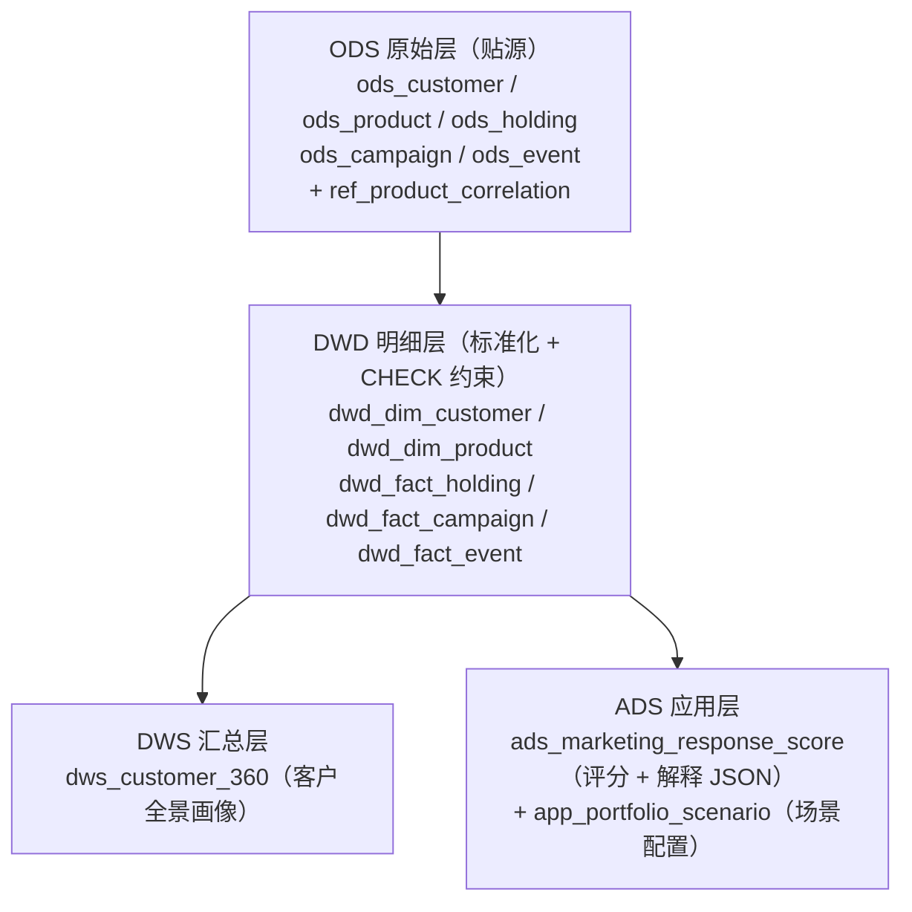
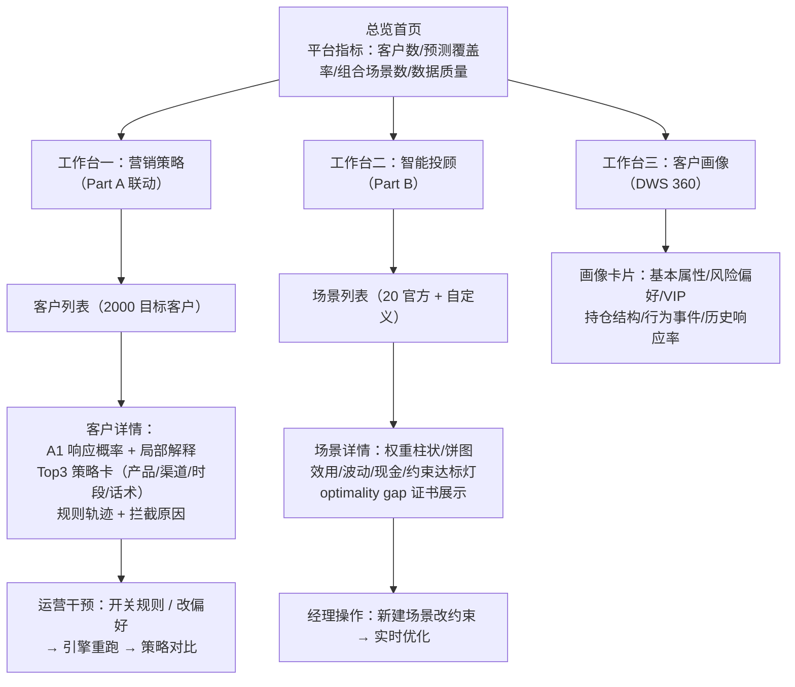

# SDD · 平台规格（Part C/D）

> 范围：数据分层、API、前端运营看板（Part C 系统架构与工程、Part D 平台演示与看板，均为人工分）
> 状态：数据层与 API ✅ ｜ 前端看板 ⬜（本文件 §5 为明天讨论的底稿）

---

## 1. 数据层规格

### 1.1 分层设计

### 1.2 表清单与关键约束

| 层 | 表 | 关键点 |
|----|----|--------|
| ODS | 5 张业务表 | 主键 + 联合索引（customer/date 类）+ `etl_batch_id` 批次溯源 + `loaded_at` |
| REF | `ref_product_correlation` | 900 行 30×30 相关矩阵；CHECK correlation ∈ [-1,1] |
| APP | `app_portfolio_scenario` | preset/custom 场景；CHECK 枚举约束 |
| DWD | 维度/事实 ×5 | CHECK 约束下沉到库：risk ∈ R1..R5、channel/liquidity/event_type 枚举、amount>0、responded ∈ {0,1}、aum ≥ 0 |
| DWS | `dws_customer_360` | 客户画像 + 持仓/事件/营销聚合（含 response_rate） |
| ADS | `ads_marketing_response_score` | contact 级概率 + `model_version` + `feature_version` + `feature_as_of_date` + `explanation_json`；CHECK prob ∈ [0,1] |

### 1.3 初始化与质量保障

- `src/scripts/init_db.py`：建库建表 → 批次导入（2000/批，upsert 幂等）→ 行数核对 → 相关系数/预设场景 → 重建 DWD → 重建 DWS；`--schema-only` 可只建表；
- `src/sql/quality_checks.sql`：**41 项检查**，覆盖行数、空值/空串、域值、关系完整性（客户/产品存在性）、时序（触达晚于注册/产品成立）；
- 批处理 id 默认 `student_pkg_20260331`，可环境变量覆盖。

---

## 2. API 规格

### 2.1 现状（✅）

| 方法 | 路径 | 用途 |
|------|------|------|
| GET | `/health` | 健康检查 |
| GET | `/customers/<customer_id>/profile` | DWS 客户全景画像（404/503 语义化） |
| POST | `/portfolio/optimize` | 单场景组合优化（400 参数错 / 422 求解错） |
| GET | `/portfolio/scenarios` | 官方 + 自定义场景列表 |
| POST | `/portfolio/scenarios` | 新建自定义场景（201） |

### 2.2 规划（🟡 随规则引擎落地）

| 方法 | 路径 | 用途 |
|------|------|------|
| GET | `/marketing/rules` | 规则元数据（id/名称/类别/硬软/描述）→ 看板规则清单 |
| POST | `/marketing/strategy/generate` | 生成单客户 Top3 策略（含轨迹）→ 演示现场实时生成 |
| POST | `/marketing/strategy/validate` | 提交前格式/合规校验 → 错误列表 |
| POST | `/marketing/strategy/import` | 导入队友 partA_strategy.csv 落库 → 与引擎生成统一消费 |

---

## 3. 工程底座（✅）

| 项 | 现状 |
|----|------|
| 测试 | 55 个 unittest（覆盖服务、数据初始化、A1、A2 规则引擎与 Part B） |
| 依赖 | pyproject：flask / numpy / pandas / scikit-learn / scipy / pymysql / python-dotenv（uv.lock 锁定） |
| 环境 | `.env.example` 模板；Python 3.12；MySQL 8 utf8mb4 |
| 可复现 | random_state=42；训练/推理特征版本化；Part B 多起点种子固定 |
| 文档 | 本 docs/ 目录 + README 运行说明 |

> 提交物要求 `requirements.txt`（🟡 待补）：从 uv 导出 `uv pip compile` 或 `uv export`。

---

## 4. 前端看板（Part D）设计底稿

> ⬜ 待明天与队友讨论。以下为**讨论底稿**，两个方案可二选一或混合。

### 4.1 目标

面向**运营人员**的可视化看板，现场验收三件事：A2 策略的**个性化**、**合规性**、**平台联动**（题目原文），同时演示两条链路与数据架构。

### 4.2 页面结构

### 4.3 两个实现档位（明天讨论）

| 维度 | 方案 A：静态展示型 | 方案 B：联动引擎型 |
|------|-------------------|-------------------|
| 数据来源 | 直接读 CSV/DB 预生成结果 | 调 API 实时生成 + 规则轨迹 |
| 运营干预 | 无 | 规则开关/参数调整 → 重跑策略 |
| 合规性演示 | 展示校验结论 | 逐条展示规则命中/拦截 + 干预后变化 |
| 开发量 | 小（1~2 天） | 中（3~4 天，需先落地规则引擎） |
| 对 D 验收的支撑 | 及格：有看板有演示 | 满分叙事：题目"平台联动"原文命中 |

**建议**：以方案 A 起步保证"有演示"，规则引擎落地后升级方案 B 的交互部分（工作台一先升级，二/三保持静态）。

### 4.4 技术选型建议（待定）

- 轻量 SPA（如 Vue3 + ECharts，或纯 HTML+JS+Chart 库），静态资源由 Flask 托管；
- 数据全部走现有 REST API（JSON），不引入新后端框架；
- 看板需要有「数据从 MySQL 分层来」的证据链展示（架构叙事素材）。

---

## 5. 演示脚本（Part D 现场，草稿）

1. 打开总览 → 指认数据分层（ODS→DWD→DWS→ADS 实时查询）
2. 工作台三：搜索一个客户 → 360 画像（呼应数据链路一）
3. 工作台一：选客户 → 看 A1 概率与解释 → Top3 策略 + 规则轨迹 → 关掉一条规则/改渠道偏好 → 策略变化（联动）
4. 工作台二：选官方场景 → 权重方案与约束达标 → 新建场景改风险厌恶 → 新方案与 gap 证书
5. 收尾：数据质量看板 41 项检查全绿（工程严谨性）

---

## 6. 与评分标准映射

| 题目要求 | 落点 |
|----------|------|
| 系统架构设计 | 数据分层 + 双源算法层 + 无状态服务 + 架构决策记录（ADR） |
| 规则/流程引擎实现 | `src/marketing/`（设计定稿，见 sdd-marketing §7） |
| 可视化看板 | 前端三工作台（本节 §4） |
| A2 个性化/合规性/平台联动现场验收 | 工作台一的规则轨迹 + 运营干预 |
| 演示可复现 | README + 离线 CSV 模式 + 现场复跑 |
