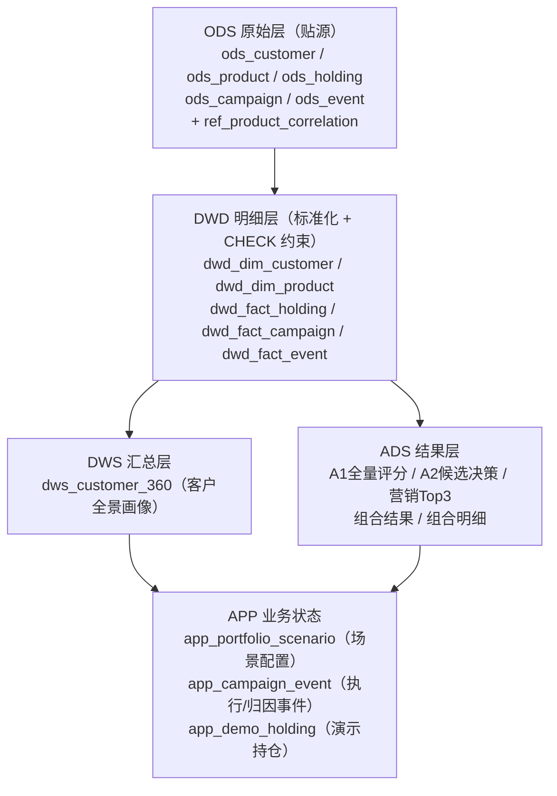
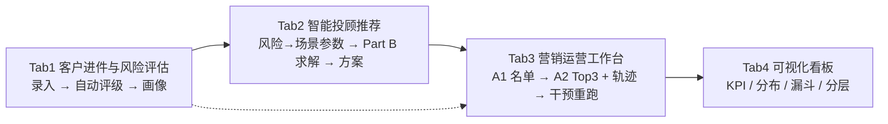

# SDD · 平台规格（Part C/D）

> 范围：数据分层、API、前端运营看板（Part C 系统架构与工程、Part D 平台演示与看板，均为人工分）
> 状态：数据层、API 与四页前端主流程均已实现 ✅

---

## 1. 数据层规格

### 1.1 分层设计

### 1.2 表清单与关键约束

| 层 | 表 | 关键点 |
|----|----|--------|
| ODS | 5 张业务表 | 主键 + 联合索引（customer/date 类）+ `etl_batch_id` 批次溯源 + `loaded_at` |
| REF | `ref_product_correlation` | 900 行 30×30 相关矩阵；CHECK correlation ∈ [-1,1] |
| APP | `app_portfolio_scenario` / `app_campaign_event` / `app_demo_holding` | 场景配置、append-only执行归因事件与演示持仓；与离线数仓分开 |
| DWD | 维度/事实 ×5 | CHECK 约束下沉到库：risk ∈ R1..R5、channel/liquidity/event_type 枚举、amount>0、responded ∈ {0,1}、aum ≥ 0 |
| DWS | `dws_customer_360` | 客户画像 + 持仓/事件/营销聚合（含 response_rate） |
| ADS | `ads_a1_customer_product_score` / `ads_a2_candidate_decision` / `ads_marketing_strategy` / `ads_portfolio_result` / `ads_portfolio_allocation` | 批次日期、模型/规则版本、逐候选轨迹与最终展示结果；同日期幂等覆盖 |

### 1.3 初始化与质量保障

- `src/scripts/init_db.py`：建库建表 → 批次导入（2000/批，upsert 幂等）→ 行数核对 → 相关系数/预设场景 → 重建 DWD → 重建 DWS；`--schema-only` 可只建表；
- `src/sql/quality_checks.sql`：**41 项检查**，覆盖行数、空值/空串、域值、关系完整性（客户/产品存在性）、时序（触达晚于注册/产品成立）；
- 批处理 id 默认 `student_pkg_20260331`，可环境变量覆盖。

---

## 2. API 规格

### 2.1 现状（✅）

| 方法 | 路径 | 用途 |
|------|------|------|
| GET | `/health` | 健康检查 |
| GET | `/customers/<customer_id>/profile` | DWS 客户全景画像（404/503 语义化） |
| POST | `/portfolio/optimize` | 单场景组合优化（400 参数错 / 422 求解错） |
| GET | `/portfolio/scenarios` | 官方 + 自定义场景列表 |
| POST | `/portfolio/scenarios` | 新建自定义场景（201） |

### 2.2 营销与看板接口（✅）

| 方法 | 路径 | 用途 |
|------|------|------|
| GET | `/marketing/rules` | 规则元数据（引擎 `metadata()` 直出）→ Tab3 规则清单 |
| POST | `/marketing/strategy/generate` | 单客户策略试算；复用 A1+规则逻辑但不覆盖正式 ADS |
| GET | `/marketing/tasks` | 全量客户机会队列与 ADS 就绪状态 |
| GET | `/customers/<id>/strategies` | 读取最新 `ads_marketing_strategy` Top3 与规则轨迹 |
| POST | `/campaign/events` | 联系事实与购买响应归因事件 |
| GET | `/dashboard/summary` | Tab4 聚合数据（KPI/分布/漏斗/分层行数） |

### 2.3 运行表设计（✅）

**`ads_marketing_strategy`**（营销工作台唯一 Top3 来源）：

| 字段 | 说明 |
|------|------|
| strategy_date / customer_id / strategy_rank / product_id | 同一批次每客户恰好 rank 1-3 |
| recommended_channel / recommended_time / marketing_script | 与提交 CSV 同构 |
| a1_probability / a1_rank | A1 原始概率和过滤前排名 |
| rule_trace_json / selection_reason | A2 规则证据与 Top3 选择说明 |
| model_version / rule_version / batch_id | 可复现批次元数据 |

**`app_campaign_event`**（Tab3 触达管理/执行归因）：

| 字段 | 说明 |
|------|------|
| campaign_event_id / strategy_id | append-only事件主键与策略关联 |
| event_type / occurred_at | sent / responded及发生时间 |
| product_id / amount | responded购买事实；sent时为空 |
| responded_strategy_id | 生成列唯一约束，数据库级保证同一策略只归因一次 |

赛事 2000 人的 `partA_strategy.csv` 只用于自动评分；业务平台对符合 as-of 条件的全量客户执行日批，并统一读取 ADS。

---

## 3. 工程底座（✅）

| 项 | 现状 |
|----|------|
| 测试 | unittest（服务、数据初始化、A1、A2 规则引擎、Part B） |
| 依赖 | pyproject + requirements.txt 双轨；Python 3.12；MySQL 8 |
| 可复现 | random_state=42；训练/推理特征版本化；Part B 多起点种子固定 |
| 文档 | `src/docs/` + README 运行说明 |

---

## 4. 前端看板规格（官方四 Tab，Part D 定稿）

> 依据：赛会参考骨架 `src/docs/index.html`（四 Tab：客户进件与风险评估 / 智能投顾推荐 / 营销运营工作台 / 可视化看板）。前端实现在 `frontend/`，保持四 Tab 结构与骨架样式，填充 TODO。

### 4.1 Tab1 客户进件与风险评估

| 功能点 | 数据源 / 实现 | 状态 |
|--------|--------------|------|
| 客户信息录入表单 | 字段 = `t_customer` 属性（年龄/城市/职业/收入/AUM/是否装App） | 🟡 前端组件 |
| **自动风险评估** | 用 8000 条 `t_customer` 样本拟合"属性 → risk_appetite"：方案 A 决策树（可解释，落地快）或方案 B 复用营销规则引擎（age/income/aum 分箱打分，强化"规则引擎"统一叙事） | 🟡 新算法点 |
| 画像生成 | 进件 → INSERT `ods_customer`（register_date=当日）→ 单客户画像 SQL → 返回画像 JSON | 🟡 POST /customers/intake |
| 页面组件 | 表单、评估结果卡（R 等级 + 依据）、画像卡 | 🟡 前端 |

**演示故事线**：现场录入一个新客户 → 系统给风险评级（并展示评级依据）→ 画像生成 → 评级自动传入 Tab2。

### 4.2 Tab2 智能投顾推荐

| 功能点 | 数据源 / 实现 | 状态 |
|--------|--------------|------|
| **风险偏好 → 场景参数映射** | 建议值（实现时按官方 20 场景 λ∈[0.58,2.98] 校准）：R1→λ2.9/高风险0.0、R2→λ2.2/0.1、R3→λ1.5/0.3、R4→λ0.9/0.5、R5→λ0.6/0.7；其余约束给统一默认 | 🟡 新映射表 |
| 组合求解 | `/portfolio/optimize`（读 MySQL，gap 证书） | ✅ |
| 场景选择与调整面板 | `/portfolio/scenarios` 列表 + 约束编辑 | ✅/🟡 |
| 页面组件 | 场景选择器、约束面板、权重条形图、摘要卡（效用/波动/现金）、约束达标灯、gap 徽章 | 🟡 前端 |

**演示故事线**：Tab1 的评级自动带出场景参数 → 一键求解 → 经理现场调 max_high_risk_weight → 秒级重算 → 展示 gap≈0 证书。

### 4.3 Tab3 营销运营工作台（A2 验收重点）

| 功能点 | 数据源 / 实现 | 状态 |
|--------|--------------|------|
| 响应名单（按概率排序 + 筛选） | `ads_a1_customer_product_score` | ✅ |
| 客户营销策略（Top3 卡） | `ads_marketing_strategy` | ✅ |
| **策略下钻**（为什么这么推） | 引擎 `rule_trace` + A1产品级在线复核与解释因子 | ✅ |
| **策略试算** | 调整 manager 配额 → 复用 A1+规则逻辑试算，不覆盖正式日批 | ✅ |
| 触达管理/执行追踪 | `app_campaign_event` 推导待执行→已触达→已响应 | ✅ |
| 页面组件 | 全量客户队列、Top3、解释/合规/话术、归因、数据链路 | ✅ |

**演示故事线**：名单按概率排序 → 下钻客户 → Top3 + 规则轨迹 + 解释因子（个性化+合规）→ 标记触达 → 购买回流自动归因 → 状态流转到看板漏斗。

### 4.4 Tab4 可视化看板

| 图表 | 数据源 | 状态 |
|------|--------|------|
| KPI 卡：AUC/F1/Lift、预测覆盖、策略数、Part B 总效用 | A1 模型元数据 + ADS 汇总 | ✅ |
| 响应概率分布直方图 | `ads_a1_customer_product_score` | ✅ |
| 资产配置分布（按风险等级/产品类型） | `ads_portfolio_allocation` 聚合 | ✅ |
| 营销转化漏斗（触达→响应） | `t_campaign` 历史漏斗；联动后加 `app_campaign_execution` 实时漏斗 | ✅/🟡 |
| 数据分层全景（ODS→DWD→DWS→ADS 行数） | 现成 COUNT SQL | ✅ |
| 渠道/时段分布 | `ads_marketing_strategy` 聚合 | ✅ |

### 4.5 实现分期与分工

| 期 | 内容 | 目标 |
|----|------|------|
| M1 静态可演示 | 四 Tab 全部填满：后端脚本预生成 `dashboard_summary.json` + 策略/轨迹 JSON 快照，前端读静态数据 | 先保证"有完整演示" |
| M2 联动引擎 | 营销 API（rules/generate/validate）、进件 API、触达状态表、实时重算与前后对比 | 满分叙事（平台联动原文命中） |
| 分工 | 前端成员按 §4 组件清单实现页面（骨架已有）；工程线提供 M1 数据快照与 M2 API | — |

---

## 5. 演示脚本（四 Tab 顺序，≤10 分钟）

1. **Tab4 看板**：全局 KPI + 数据分层行数 + 41 项质量检查全绿（架构工程性）
2. **Tab1 进件**：现场录入客户 → 自动风险评估（展示依据）→ 画像生成
3. **Tab2 投顾**：评级自动带出场景参数 → 求解 → 经理改约束 → 重算 + gap 证书
4. **Tab3 营销**：响应名单 → 客户 Top3 + 规则轨迹 + 解释因子 → 策略试算 → 触达与购买归因
5. 收尾：回到 Tab4，漏斗联动更新（闭环）

---

## 6. 与评分标准映射

| 题目要求 | 落点 |
|----------|------|
| 系统架构设计 | 数据分层 + 双源算法层 + 无状态服务 + ADR |
| 规则/流程引擎实现 | `src/marketing/`（已实现，见 sdd-marketing）+ Tab1 风险评估可复用同一引擎 |
| 可视化看板 | 官方四 Tab（§4） |
| A2 个性化/合规性/平台联动现场验收 | Tab3 轨迹下钻 + 解释因子 + 干预重跑 |
| 演示可复现 | README + 离线 CSV 模式 + 现场复跑 |
