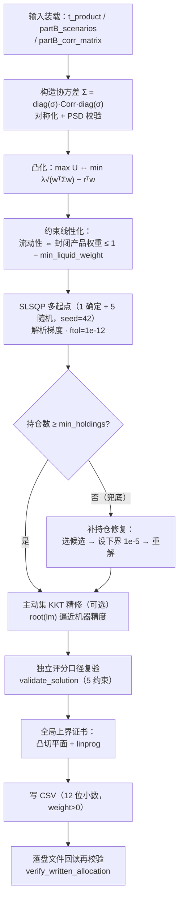

# SDD · 投顾链路（Part B）规格

> 范围：Part B 投资组合配置优化（15 分自动）
> 状态：✅ 已实现并验证
> 关联：[architecture.md](architecture.md) §5

---

## 1. 任务与判分口径

- 输入：`t_product.csv`（30 产品）、`partB_scenarios.csv`（20 场景）、`partB_corr_matrix.csv`（30×30）
- 输出：`partB_allocation.csv`，列 `scenario_id, product_id, weight`，仅列 weight>0 的行
- 目标：每个场景在满足全部约束下最大化效用

$$U = \sum_i w_i r_i - \lambda \sqrt{w^\top \Sigma w},\quad \Sigma_{ij}=\sigma_i\sigma_j\rho_{ij}$$

现金（余下仓位）收益与波动均为 0。

**约束（校验容差 1e-6，任一违反该场景记 0）**：
1. Σw ≤ 1（现金 ≥ 0）
2. 0 ≤ w_i ≤ max_single_weight
3. R4/R5 权重合计 ≤ max_high_risk_weight
4. 高流动产品（T+0/T+1）+ 现金 ≥ min_liquid_weight
5. 持仓数 ≥ min_holdings（weight ≥ 1e-6 计持仓）

**得分**：`max(3, min(15, 6 + (total_U − baseline_U)/(optimal_U − baseline_U) × 9))`，其中 total_U 为 20 场景效用之和；`total_amount`/`min_invest` 不参与自动评分。

---

## 2. 求解方法设计



### 关键设计点

| 点 | 说明 |
|----|------|
| 凸性利用 | 连续部分（去 min_holdings）是凸问题：SLSQP 收敛稳定解即全局最优，不需黑盒元启发 |
| 多起点 | 1 个确定性保守起点 + 5 个随机可行起点（random_state=42），记录多起点效用差检验稳定性 |
| min_holdings 兜底 | 当前官方 20 场景连续最优解天然满足（实测 14~30 个持仓 ≥ 要求），修复逻辑仅作参数被现场修改时的保险 |
| KKT 精修 | 识别 active 约束（Σw=1、高风险上限、单产品上限）后解 KKT 方程，残差推到 ~1e-12；精修解须通过约束复验且效用不降才采用 |
| 全局上界证书 | 凸函数一阶切平面在放松可行域上 linprog 求下界 → 效用上界；gap = 上界 − 当前效用 |
| 落盘复验 | 内存高精度解可行 ≠ CSV 四舍五入后可行，必须对真正上传的文件再跑一遍 validator |

---

## 3. 当前验证结果

| 指标 | 值 |
|------|----|
| 场景数 | 20/20 全部求解成功 |
| 单场景 optimality gap | 0 ~ 7e-18（机器精度） |
| 落盘 CSV 行数 | 493 行（仅 weight>0） |
| 重复 (scenario_id, product_id) | 0 |
| 约束违例 | 0 |
| 落盘 total_U | ≈ 0.611230 |
| 持仓修复触发 | 0 次 |

> 得分取决于官方 baseline_U / optimal_U 锚点，本解法 gap≈0 即站在 optimal_U 一侧，预期满分档。

---

## 4. 提交文件规格

| 规则 | 实现位置 |
|------|----------|
| 列名 `scenario_id, product_id, weight` | `write_allocation_csv` |
| 仅 weight>0 的行；未出现视为 0 | 同上 |
| weight ≥ 0、非空、非数字则场景判 0 | `verify_written_allocation` |
| product_id ∈ P001~P030 | 同上（未知 id 报错） |
| 同场景同产品不重复 | 同上（seen_pairs 检查） |
| 精度 12 位小数 | `OUTPUT_DECIMALS=12` |

辅助产物：`src/data/outputs/partB_optimality_audit.csv`（20 场景 × 22 个诊断列，答辩用）。

---

## 5. 平台侧 API 规格（✅ 已实现）

### POST /portfolio/optimize

请求（经理自定义场景）：

```json
{
  "total_amount": 500000, "risk_aversion": 0.94,
  "max_single_weight": 0.3, "max_high_risk_weight": 0.5,
  "min_liquid_weight": 0.2, "min_holdings": 4
}
```

响应：场景回显 + 摘要（效用/期望收益/波动率/现金权重/持仓数/高风险权重/流动性达标/optimality_gap）+ 逐产品配置（含金额）。

- 输入来自 MySQL `dwd_dim_product` + `ref_product_correlation`（进程级缓存）；
- 参数校验：数值有限、区间合法、min_holdings 为整数且 ∈ [1, 产品数]；错误码 400（参数）/ 422（求解）。

### GET/POST /portfolio/scenarios

- 官方 20 个预设场景（`partB_scenarios.csv` 导入，`scenario_type='preset'`）+ 经理自定义（`CUSTOM_xxxxxxxxxxxx`）；
- 场景参数与题目约束字段一一对应，看板投顾工作台直接消费。

---

## 6. 复现步骤

```bash
uv sync
# 离线求解（CSV 直读，不依赖数据库）
uv run python -m src.pipelines.solve_partB \
  --data-dir src/data/raw \
  --output partB_allocation.csv \
  --audit src/data/outputs/partB_optimality_audit.csv
```

README 已包含上述入口。答辩现场可复跑证明可复现性（20 场景 <1 分钟）。

---

## 7. 答辩要点

1. **为什么不用黑盒优化**：问题连续部分是凸的，凸化 + 多起点 + KKT 精修 = 可证明全局最优，配切平面上界证书把"接近最优"变成"证明了接近最优"；
2. **min_holdings 离散约束怎么处理**：连续最优解天然满足 + 确定性兜底修复（设下界重解），现场改参数也不翻车；
3. **评分容差 1e-6 的工程处理**：输出 12 位小数、NUMERIC_ZERO=1e-12 清噪、落盘复验——把"内存可行"和"上传文件可行"画等号；
4. **平台联动**：求解器同时服务离线提交与在线 API，经理在前端调约束 → 秒级出新方案。
